<p align="center">
  
</p>

<p align="center">
  <a href="mailto:hello.choudharymahendra@gmail.com"></a>
  <a href="https://mahendrachoudhary.in/"></a>
  <a href="https://www.linkedin.com/in/mahendrachoudhary-in/"></a>
  
</p>

Seven years across Angular and React front ends, Node.js microservices, and the AWS, GCP and Kubernetes plumbing underneath. Currently a module lead engineer at **Impetus Technologies**, working on Dun & Bradstreet's SMB platform.

### `$ git log --career`

```text
* HEAD  Feb 2024 – now       Module Lead Software Engineer · Impetus Technologies
│       Microservices on GCP Pub/Sub, MSSQL, TypeScript · test framework past 80% coverage
│
* 2021  Nov 2021 – Dec 2023  Lead Software Engineer · Persistent Systems
│       5+ enterprise microservice apps for finance clients · MTTR down 40%
│
* 2019  Mar 2019 – Nov 2021  Software Engineer · Techinfini
│       MERN Shopify apps for 500+ merchants · AWS move cut operating cost 20%
│
* init  Aug 2018 – Feb 2019  Engineering Intern · Ypsilon
        Built BechDe.com front to back · user engagement up 15%
```

### `$ ls ./work`

| Project | For | What shipped | Stack |
| :--- | :--- | :--- | :--- |
| **DNB SMB Platform** | Dun & Bradstreet · 2025 | Credit Insights went multi-user: Owner/Admin/Regular roles, granular RBAC, resource sharing | Node.js, TypeScript, MSSQL, Pub/Sub |
| **Gathr ETL & Talkbar AI** | Impetus · 2024–25 | Angular upgrade cut the bundle from 8 MB to 3 MB; multi-tenant theming; embeddable AI chat widget | Angular 19, Angular CDK, Jasmine |
| **Enterprise AI RAG** | Impetus · 2024 | Retrieval-augmented chat with a crawling and file-processing pipeline | NestJS, Next.js, Pinecone |
| **Escrow Web Application** | IDFC First Bank | Intermediate API layer for a banking escrow product | Express, MongoDB |
| **Trade Credit Platform** | Chubb UK | REST APIs from scratch for trade-credit insurance | TypeScript, Lerna |
| **Notification System** | Aditya Birla Capital | Scheduled microservices feeding real-time cross-platform delivery | Docker, Kubernetes |

### `$ ls ./stack`

```text
frontend/   Angular 17–19  React  Redux  TypeScript  Angular Material  Angular CDK  Bootstrap
backend/    Node.js  Express  NestJS  REST  microservices  Kafka  GCP Pub/Sub
data/       MongoDB  CosmosDB  MySQL  MSSQL  PostgreSQL  Pinecone
platform/   AWS (EC2, RDS, S3, Lambda)  Docker  Kubernetes  CI/CD  Jest  Jasmine  Karma
```

### `$ git stats`

<p>
  
  
</p>

### `$ ping mahendra`

Have a platform that needs building properly? Open to senior and lead full-stack roles — email is fastest.

**[hello.choudharymahendra@gmail.com](mailto:hello.choudharymahendra@gmail.com)** &nbsp;·&nbsp;
[mahendrachoudhary.in](https://mahendrachoudhary.in/) &nbsp;·&nbsp;
[LinkedIn](https://www.linkedin.com/in/mahendrachoudhary-in/)
