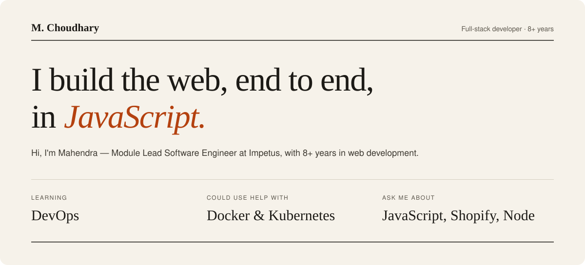

  

  <a href="mailto:hello.mahendrachoudhary@gmail.com"><b>hello.mahendrachoudhary@gmail.com</b></a>
  &nbsp;·&nbsp; <a href="https://linkedin.com/in/mahendrachoudhary-in">LinkedIn</a>
  &nbsp;·&nbsp; <a href="https://docs.google.com/document/d/1b0GK3H4mGVAzxTPLjfcAEeXi3l_8m8sVwp169UKcOu4/edit?usp=sharing">Full experience</a>

## Career

| Role | Company |
| :--- | :--- |
| **Module Lead Software Engineer** · *current* | Impetus |
| *Previously* | Persistent Systems |
| *Previously* | TechInfini Solutions |

8+ years in web development, from Trainee Software Engineer to Module Lead. The full story is in my [experience doc →](https://docs.google.com/document/d/1b0GK3H4mGVAzxTPLjfcAEeXi3l_8m8sVwp169UKcOu4/edit?usp=sharing)

## Toolbox

**Frontend** — JavaScript, TypeScript, React, HTML5, CSS3, Bootstrap, Materialize, Pug, Chart.js

**Backend** — Node.js, Express, PHP, Java, Python

**Data** — MongoDB, MySQL, PostgreSQL

**Ops & tooling** — AWS, Docker, Kubernetes, Nginx, Heroku, Linux, Bash, Git, Postman, Jest

## On GitHub

  
  

---

  <a href="https://linkedin.com/in/mahendrachoudhary-in">LinkedIn</a> &nbsp;·&nbsp;
  <a href="https://instagram.com/thatguyfromindore">Instagram</a> &nbsp;·&nbsp;
  <a href="https://fb.com/mahendrachoudhary.in">Facebook</a> &nbsp;·&nbsp;
  

